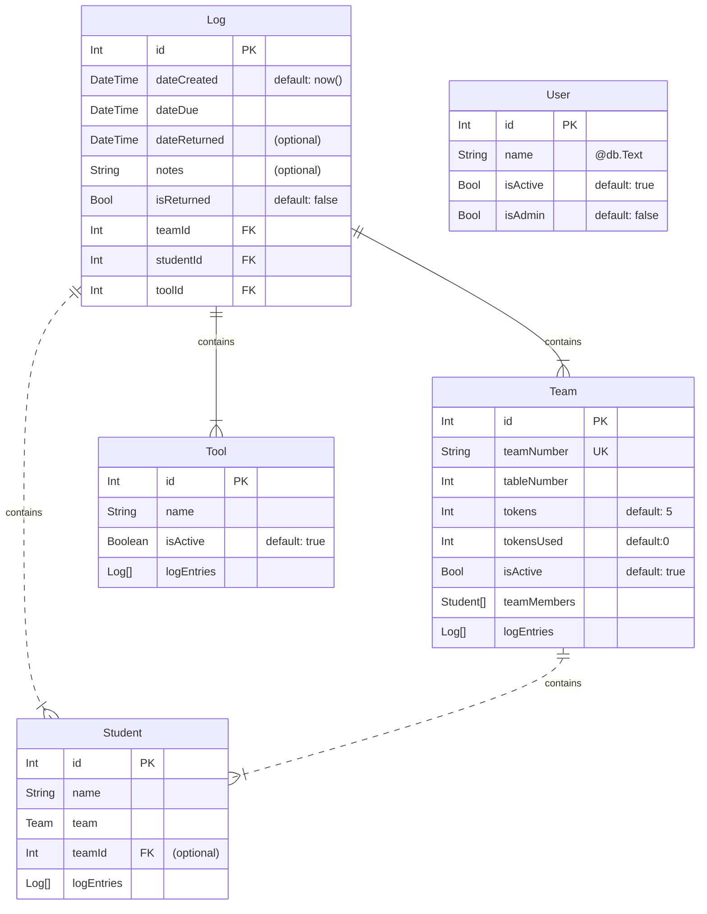

# UTDesign Toolcrib Inventory Tracker

## Table of Contents

- [Prerequisites](#prerequisites)
  - [auth0](#auth0)
    - [Adding User Roles](#adding-user-roles)
    - [Passing User Roles to Application](#passing-user-roles-to-application)
  - [.env.local](#envlocal)
- [Starting the Database](#starting-the-database)
- [Running the Development Server](#running-the-development-server)
  - [Installing Packages](#installing-packages)
  - [Configure Prisma Client](#configure-prisma-client)
  - [Start Development Server](#start-development-server)
- [Building The Project](#building-the-project)
  - [Pre-Build](#pre-build)
  - [Build](#build)
  - [Serve the Application](#serve-the-application)
- [Documentation](#documentation)
  - [Database Schema](#database-schema)
- [Learn More About Next.js](#learn-more-about-nextjs)

## Prerequisites

### auth0

This project uses [auth0](https://auth0.com) for user authentication. You will need a free account and a little bit of setup to start. It is recommended following [this guide](https://auth0.com/docs/quickstart/webapp/nextjs/01-login) to get started. The `.env.local` file mentioned in the guide is explained in a bit more detail in the next section.

#### Adding User Roles

**To avoid the somewhat complex setup of passing role information to the application**, you can comment out the following from `middleware.js` at the top level of the project and skip to [this section](#envlocal) on the `.env.local` file.

```js
const user = await getSession(req);
    
if (!user.user["http://localhost:3000/roles"].includes('Admin')) {
    if (req.nextUrl.pathname.startsWith('/Admin')) {
        const url = req.nextUrl.clone()
        url.pathname = '/'
        return NextResponse.redirect(url)
    }
    if (req.nextUrl.pathname.startsWith('/api/admin')) {
        return new Response("Unauthorized", {status:  401});
    }
}
return NextResponse.next();
```

The application uses the `Admin` role in auth0 to protect the admin panel. To add this role to your tenant, use [this auth0 documentation](https://auth0.com/docs/manage-users/access-control/configure-core-rbac/roles).

#### Passing User Roles to Application

Finally, the role needs to be passed on to the user via a JWT. To do this, an auth0 action needs to be created using an auth0 Action. [Follow this guide](https://auth0.com/docs/customize/actions/write-your-first-action#create-an-action) to create an action that happens during the **login** flow using the code below. The namespace is very important, but could be changed using an environment variable.

```js
exports.onExecutePostLogin = async (event, api) => {
  const namespace = 'http://localhost:3000';
  if (event.authorization) {
    api.idToken.setCustomClaim(`${namespace}/roles`, event.authorization.roles);
    api.accessToken.setCustomClaim(`${namespace}/roles`, event.authorization.roles);
  }
};
```

### .env.local

There is a `.env.local` file that needs to be configured before running anything. Copy/rename `env.local.example` to `.env.local` and fill in the required auth0 and MySQL database information

## Starting the Database

To run the database, docker compose needs to be installed. Follow the steps at [https://docs.docker.com/engine/install/](https://docs.docker.com/engine/install/) if you need help. You can then run the following command to start the MySQL database.

```bash
docker compose up -d
```

## Running the Development Server

### Installing Packages

Before running the server, all packages need to be installed:

```bash
npm install
# or
yarn install
# or
pnpm install
```

### Configure Prisma Client

Next, ensure [Prisma](https://www.prisma.io) is configured correctly:

```bash
npm prismaPush
# or
pnpm prismaPush
```

### Start Development Server

Finally, run the development server:

```bash
npm run dev
# or
yarn dev
# or
pnpm dev
```

Open [http://localhost:3000](http://localhost:3000) with your browser to see the result.

You can start editing any of the files and when they are saved, the development server will automatically update them

## Building The Project

### Pre-Build

Before building, make sure to set the ```AUTH0_BASE_URL``` environment variable to the url where the server will be hosted in the ```.env.production``` file (alternatively, the value in `.env.local` will overwrite the value). If you are not using https, then it should be localhost.

Additionally, you will need to adjust the callback URLs in your auth0 configuration in order to still work with the new web address.

### Build

Assuming the database is up to date (using `npm prismaPush` or `npm prismaMigrate`) and running, building the project can be accomplished with:

```bash
npm build
# or
pnpm build
```

### Serve the Application

Once the project is built, start the server using:

```bash
npm start
# or
pnpm start
```

## Documentation

### Database Schema



## Learn More About Next.js

To learn more about Next.js, take a look at the following resources:

- [Next.js Documentation](https://nextjs.org/docs) - learn about Next.js features and API.
- [Learn Next.js](https://nextjs.org/learn) - an interactive Next.js tutorial.

You can check out [the Next.js GitHub repository](https://github.com/vercel/next.js/) - your feedback and contributions are welcome!
